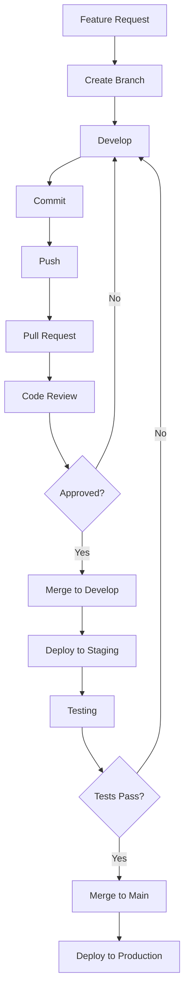

# 🏥 S2S Org

### 💊 Building the Future of Healthcare Technology

---

## 🌟 About Us

**S2S Org** is a technology organization dedicated to building innovative healthcare and software solutions. Our mission is to combine modern development practices with real-world experience to create software that improves workflows, collaboration, and user experiences.

### 🎯 Our Mission

*"Empowering healthcare through technology, one line of code at a time"

## 🚀 What We Build

<table>
<tr>
<td width="50%">

### 📱 Mobile Applications
Building cross-platform healthcare apps with **Flutter** that provide seamless patient experiences and efficient medical workflows.

</td>
<td width="50%">

### 🌐 Web Platforms
Creating responsive, modern web applications using **React** for healthcare management and patient portals.

</td>
</tr>
<tr>
<td width="50%">

### ⚙️ Backend Systems
Developing robust, scalable APIs with **.NET** to power our healthcare solutions with enterprise-grade reliability.

</td>
<td width="50%">

### 🗄️ Data Management
Leveraging **PostgreSQL** for secure, HIPAA-compliant data storage and advanced healthcare analytics.

</td>
</tr>
</table>

## 🛠️ Technical Arsenal

<table>
  <tr>
    <td align="center" width="33%">
      <h3>📱 Mobile Development</h3>
      
    </td>
    <td align="center" width="33%">
      <h3>🌐 Web Development</h3>
      
    </td>
    <td align="center" width="33%">
      <h3>⚙️ Backend Development</h3>
      
    </td>
  </tr>
  <tr>
    <td align="center">
      <h3>🗄️ Database</h3>
      
    </td>
    <td align="center">
      <h3>🔧 DevOps & Tools</h3>
      
    </td>
    <td align="center">
      <h3>☁️ Cloud & Services</h3>
      
    </td>
  </tr>
  <tr>
    <td align="center" colspan="3">
      <h3>🤖 AI & Data Science</h3>
      
    </td>
  </tr>
</table>

## 👥 Our Team

We're proud to have a talented team of developers, designers, and healthcare professionals working together to build amazing solutions.

### 📊 Team Statistics

<table align="center">
<tr>
<td align="center">

</td>
<td align="center">

</td>
<td align="center">

</td>
</tr>
</table>

## 📚 Resources & Documentation

| Resource | Description | Link |
|----------|-------------|------|
| 📖 **Organization Guide** | Complete guide to our workflows and practices | [Visit Guide](https://github.com/S2S-org) |
| ⚡ **Git Workflow** | Professional Git practices and conventions | [Git Guide](https://github.com/S2S-org) |
| 🎯 **Best Practices** | Coding standards and development guidelines | [View Docs](https://github.com/S2S-org) |
| 🔧 **Setup Guide** | Quick start for new team members | [Get Started](https://github.com/S2S-org) |

## 🎓 For New Members

<b>🚀 Quick Start Guide</b>

### Welcome to S2S Org! 👋

Follow these steps to get started:

1. **📖 Read the Organization Guide**
   - Visit our organization page
   - Understand our mission and values

2. **⚡ Learn Our Git Workflow**
   - Review our branch and commit conventions
   - Understand how to contribute safely

3. **🛠️ Set Up Your Environment**
   - Install the required tools
   - Clone the repositories you need
   - Configure your development environment

4. **👥 Meet the Team**
   - Join our communication channels
   - Introduce yourself
   - Get assigned your first task

5. **💻 Start Contributing**
   - Pick up a beginner-friendly issue
   - Follow our coding standards
   - Submit your first pull request

## 🔄 Development Workflow

We follow industry-standard practices to ensure code quality and team collaboration:

### 📋 Our Process

- ✅ **Feature Branches** - Every feature gets its own branch
- ✅ **Code Reviews** - All code must be reviewed before merging
- ✅ **Automated Testing** - CI/CD pipelines ensure quality
- ✅ **Conventional Commits** - Clear, standardized commit messages
- ✅ **Documentation** - Every feature is properly documented

## 🏆 Achievements & Milestones

| Milestone | Status |
|-----------|--------|
| 🎯 Organization Setup | ✅ Complete |
| 📚 Documentation Portal | ✅ Complete |
| 🔧 Development Guidelines | ✅ Complete |
| 🚀 First Production Release | 🔄 In Progress |
| 🌟 100+ Commits | 🎯 Goal |
| 👥 10+ Contributors | ✅ Achieved |

## 💡 Contributing

We welcome contributions from all team members! Here's how you can contribute:

1. **🐛 Report Bugs** - Found a bug? Open an issue
2. **💡 Suggest Features** - Have an idea? We'd love to hear it
3. **📝 Improve Documentation** - Help make our docs better
4. **💻 Submit Code** - Follow our Git workflow and submit PRs
5. **👀 Review Code** - Help review pull requests

### 📜 Contribution Guidelines

- Follow our Git workflow and branch strategy
- Use conventional commit messages
- Write clear, descriptive PR descriptions
- Ensure all tests pass before submitting
- Update documentation as needed

## 📞 Get in Touch

### 🤝 Let's Connect

Have questions? Want to collaborate? Reach out to us!

## 🌟 Featured Projects

| Project | Description | Tech Stack | Status |
|---------|-------------|------------|--------|
| 📱 **Patient App** | Mobile app for patient management | Flutter, Dart | 🔄 Active |
| 👨‍⚕️ **Doctor App** | Mobile app for doctors | Flutter, Dart | 🔄 Active |
| 🌐 **Admin Portal** | Web-based admin dashboard | React | 🔄 Active |
| 💻 **Website** | Official organization website | React | 🔄 Active |
| ⚕️ **S2S API** | Core Backend API | .NET, C# | 🔄 Active |
| 🤖 **Medical Agent** | AI-powered medical assistant | Python, FastAPI, LLM | 🔄 Active |
| 🎧 **Support Agent** | AI Customer Support Agent | Python, AI | 🔄 Active |
| 🗄️ **Database** | Centralized Data Storage | PostgreSQL | 🔄 Active |

---

### 💖 Built with Love by the S2S Org Team

**⭐ Star our repositories | 🔔 Watch for updates | 🤝 Join our community**

