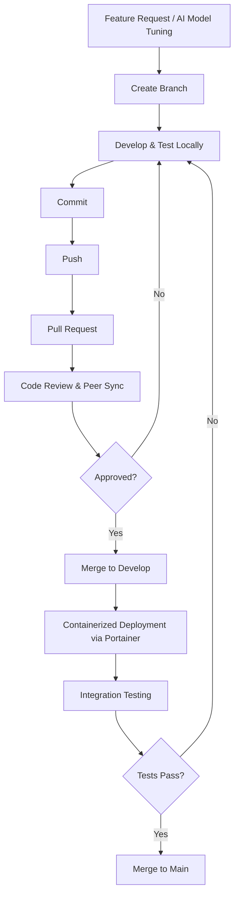

# 🤟 S2S Org (Signary-AI)

### 🌉 Bridging the Communication Gap with AI & 3D Avatars

---

## 🌟 About Us

**S2S Org** (Signary-AI) is a technology organization dedicated to building advanced accessibility solutions for the deaf and hard-of-hearing community.

Our core focus is breaking down communication barriers by translating speech and text into real-time sign language using AI, computer vision, and interactive 3D avatars.

### 🎯 Our Mission

*"Empowering inclusive communication through AI-driven sign language translation, one gesture at a time."*

## 🚀 What We Build

### 📱 Mobile Applications
Building high-performance, cross-platform applications with **Flutter** using Clean Architecture and **BLoC/Cubit** to deliver a seamless, accessible interface for live translation.

### 🤖 AI & Machine Learning
Developing intelligent computer vision models with **YOLOv8** and **TensorFlow** to accurately detect gestures and map speech/text into sign language.

### 🧍 3D Avatar Rendering
Integrating responsive **3D avatars** that render translated content as natural and readable sign language gestures in real-time.

### ⚙️ Scalable Infrastructure
Engineering robust backend services and DevOps pipelines using **.NET, Laravel, Docker, and Nginx** to ensure our AI models run efficiently and scale reliably.

## 🛠️ Technical Arsenal

<table>
  <tr>
    <td align="center" width="33%">
      <h3>📱 Mobile</h3>
      
      
Flutter, Dart, BLoC/Cubit, Clean Architecture

    </td>
    <td align="center" width="33%">
      <h3>🤖 AI</h3>
      
      
YOLOv8, TensorFlow, Pose Estimation, Computer Vision

    </td>
    <td align="center" width="33%">
      <h3>🧍 3D Avatars</h3>
      
      
3D gesture mapping, avatar animation, rendering engine

    </td>
  </tr>
  <tr>
    <td align="center">
      <h3>⚙️ Backend</h3>
      
      
.NET, Laravel, REST API, WebSockets

    </td>
    <td align="center">
      <h3>🐳 DevOps</h3>
      
      
Docker, Nginx, Portainer, CI/CD pipelines

    </td>
    <td align="center">
      <h3>☁️ Infrastructure</h3>
      
      
Container orchestration, deployment automation, monitoring

    </td>
  </tr>
</table>

## 👥 Our Team

We are a dedicated team of software engineers, AI developers, and researchers working collaboratively under the academic supervision of **Dr. Samia Sorour**.

**Core Contributors:** Hedra Nabil, Taha Mohamed, Paula Younan.

### 📊 Team Statistics

<table align="center">
<tr>
<td align="center">

</td>
<td align="center">

</td>
<td align="center">

</td>
</tr>
</table>

## 🔄 Development Workflow

We strictly adhere to clean coding standards and an organized deployment pipeline to ensure our AI models and mobile applications sync perfectly:

### 📋 Our Process

- ✅ **Feature Branches** - Every feature gets its own branch
- ✅ **Code Reviews** - Peer review is mandatory before merge
- ✅ **Automated Testing** - CI/CD validates model and UI changes
- ✅ **Modular Architecture** - Clear separation between mobile, AI, and backend
- ✅ **Documentation** - Every model and interface is documented

## 🏆 Achievements & Milestones

| Milestone | Status |
|-----------|--------|
| 🎯 Project Architecture & Planning | ✅ Complete |
| 🤖 AI Pose Detection Training | 🔄 In Progress |
| 🧍 3D Avatar Mapping Integration | 🔄 In Progress |
| 📱 Flutter App Core Interface | ✅ Complete |
| ⚙️ Docker Cluster Setup | ✅ Complete |

## 🌟 Featured Projects (Repositories)

| Project | Description | Tech Stack | Status |
|---------|-------------|------------|--------|
| 📱 **S2S Mobile App** | Primary user interface for translation | Flutter, Dart, BLoC | 🔄 Active |
| 🤖 **Signary AI Engine** | Computer vision & translation models | Python, YOLOv8, TensorFlow | 🔄 Active |
| 🧍 **Avatar Renderer** | 3D gesture rendering and mapping | Unity / Custom 3D | 🔄 Active |
| ⚙️ **Core API** | Backend systems handling real-time data | .NET, Laravel | 🔄 Active |
| 🐳 **Infra Scripts** | Docker & Nginx proxy configurations | Docker, Shell | 🔄 Active |

---

### 💖 Built for Accessibility by the S2S Org Team

**⭐ Star our repositories | 🔔 Watch for updates | 🤝 Join our community**

| 🎧 **Support Agent** | AI Customer Support Agent | Python, AI | 🔄 Active |
| 🗄️ **Database** | Centralized Data Storage | PostgreSQL | 🔄 Active |

---

### 💖 Built with Love by the S2S Org Team

**⭐ Star our repositories | 🔔 Watch for updates | 🤝 Join our community**

